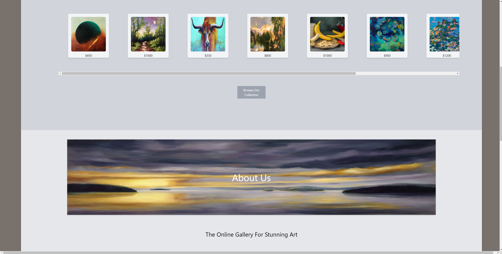
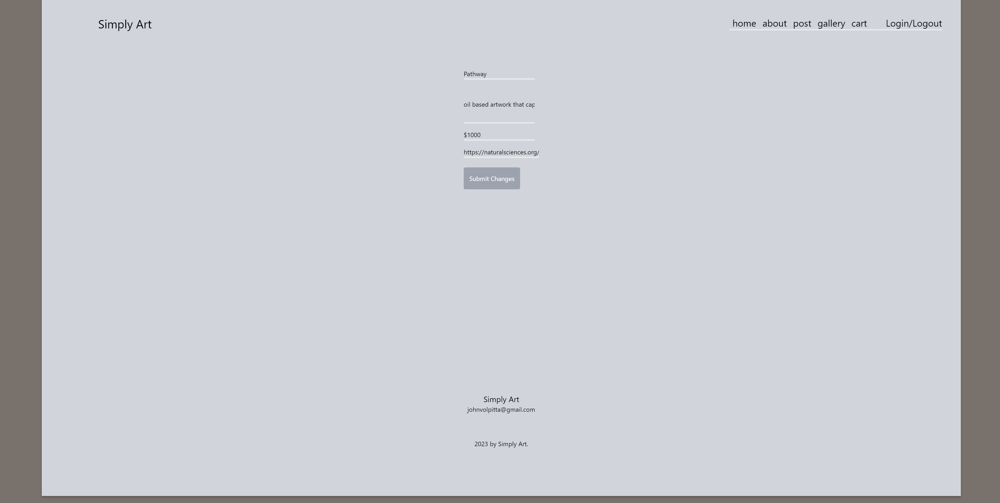

# Simply-Art
An art website where people can upload their art and sell it. Inspired by my wife's talents. Full CRUD application.  

## Table of Contents

- [About](#about)
    - [Description](#description)
    - [Technologies](#technologies)
    - [Route Table](#route_table)

- [Install](#install)
    -[Prerequisits](#prerequisits)
    -[Packages](#packages)

- [Visuals](#visuals)
    -[Index](#index)
    -[New](#new)
    -[Show](#show)
    -[Edit](#edit)
    -[About](#about)
    -[Gallery](#gallery)

- [Issues](#issues)

- [Roadmap](#roadmap)

- [Author](#Author)

## About

 (<a href="#readme-top">back to top</a>) 

**Link to Webpage**
https://simply-art.herokuapp.com/arts

### Description
This is my Unit 2 project for GA. My goal was to make an **Express CRUD** application that would incorporate a user who could add **art** to a webpage that eventually would be sold. The idea is that this webpage would be targeted towards up-and-coming artist looking to showcase and sell their art! 
### Technologies
Here is a list of technologies I used to complete this project. 
- **Express.js**
- **Node.js**
- **MongoDB**
- **JSX** 
- **JavaScript**
- **TailwindCSS**

### Route Table
## Restful routes table
| URL | HTTP VERB| Mongoose model function 
|:--------:| -------------:| -------------:|
| /arts/ | GET |.find
| /art/new | GET |N/A
| /art | POST |.create
| /art/:id | GET |.findById
| /art/:id/edit | GET |.findById
| /art/:id | PUT |.findByIdAndUpdate
| /art/:id | DELETE |.findByIdAndDelete
## Install

 (<a href="#readme-top">back to top</a>) 

### Prerequisits
- have Node version 16.18.0 or higher installed 
### Packages
to edit and get started you'll need to install these packages

**npm -y init**

**npm i bcryptjs connect-mongo dotenv express express-session jxs-view-engine method-override mongoose morgan nodemailer react react-dom**

## Visuals

 (<a href="#readme-top">back to top</a>) 

### Index
#### Initial View (Welcome)

#### Examples of Art

#### Fancy Quote

#### Contact Us

### New

### Show

#### Showing Whatever Artwork You Clicked On. 
Here you have the ability to update, delete and (soon) add to cart. 

### Edit

#### This is the Edit page

### About

#### Learn about the Artist 
Currently there is only one artist, but the idea is that as the website grows people would join and sell their art here. 

### Gallery

#### A full list of all available art

## Issues

 (<a href="#readme-top">back to top</a>) 

 ### 1.
 I initially had some issues with my routes. My index route didn't seem to be working when I would attempt to launch the server from the link in VS Code. It would give me a 
 /20%20$ on end of the URL. I realized later that this was because I had a user signed in and it was reading the same user was attempting to login.

 ### 2. 
 I didn't realize that my delete route needed to be on the show page and it wouldn't work properly for a while until I added it back. I thought it woul look cool on the edit page, but all it would do is initialize the edit route. 

 ### 3. 
 I attempted to make a contact us and didn't finish. It's styled well enough, but the actual function of it is missing something, I'll need to do more research. 

 ### 4. 
 I attempted to make a carousel on the index page but found that attempting to do that with a jsx file is harder than it looks as opposed to writing it in React. Instead I went for overflow-x-scroll and then attempted to make the scroll bar hidden until you hovered over it, but that required either Tailwind Elements or Flowbite. I decided not to mess around with either as the only examples that were given required full React and wouldn't work properly with a jsx template. I'm sure there is a way, I just need to do some more research.. or just learn React. 

## Roadmap

 (<a href="#readme-top">back to top</a>) 

### 1. 
Make it where multiple users can be signed in and can only update and delete the content they created. 

### 2. 
Finish the about page 

### 3. 
Make the Contact Us functional 

### 4. 
Create a functional cart that people can add art to to make a purchase. Set up and inventory or require people to ship out their own art. Maybe cover the shipping and handling for them. 

### 5. 
Add a "Services We Provide"
## Author

 (<a href="#readme-top">back to top</a>) 

### Fuzzy Volpitta
### https://github.com/Fuzz-Volp

#### Thank you for taking a look at my Unit-02 projext Simply Art! If you have any suggestions as to what I should do to improve it please reach out. 